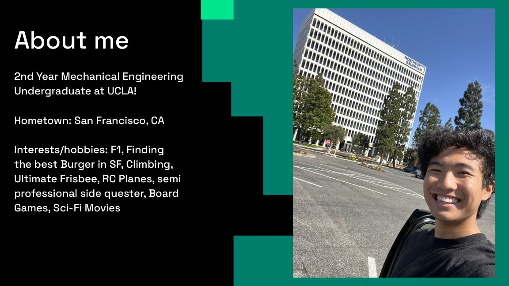
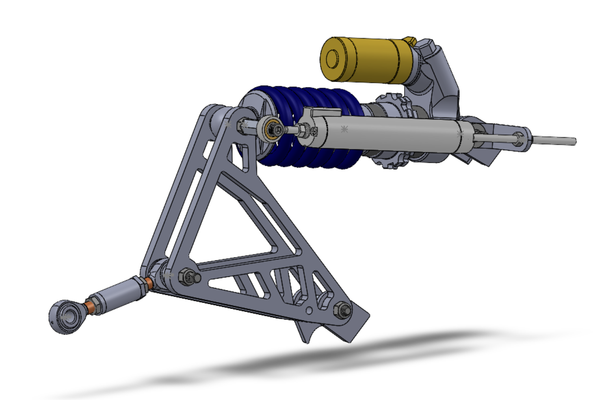
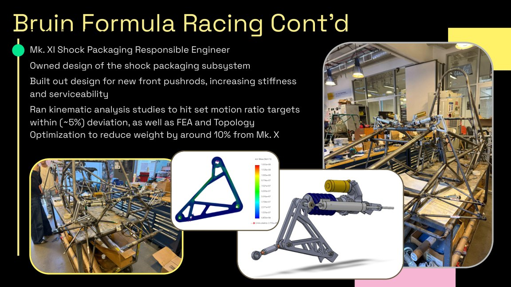
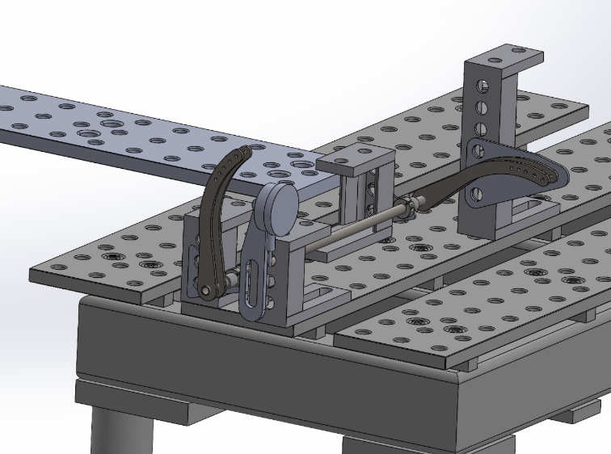
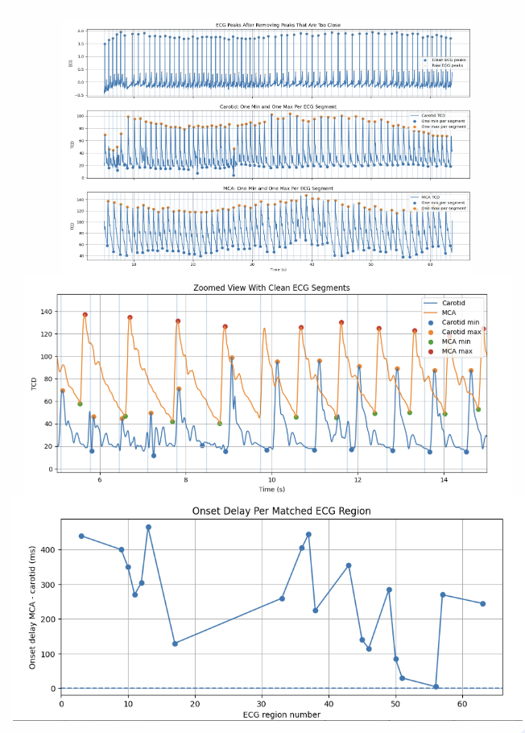
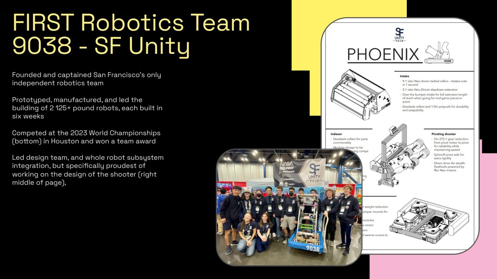
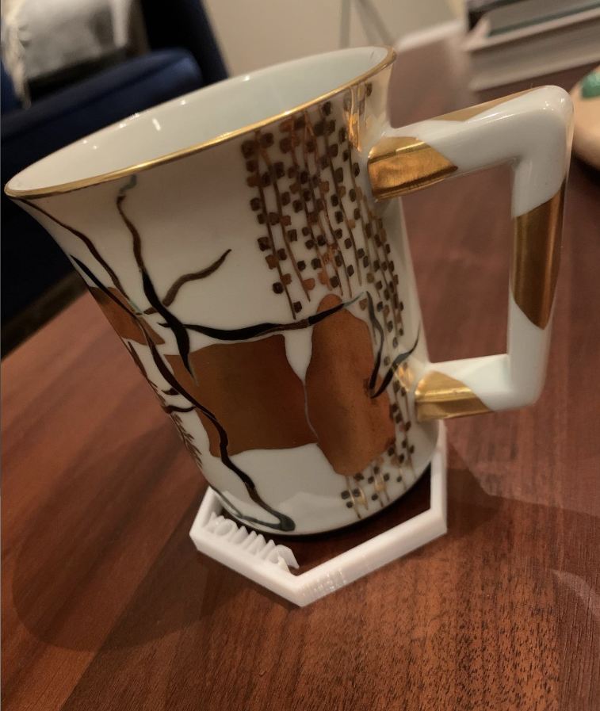

<!DOCTYPE html>
<html lang="en">
<head>
  <meta charset="UTF-8" />
  <meta name="viewport" content="width=device-width, initial-scale=1.0" />
  <title>Kyle Young — Engineering Portfolio</title>
  <meta name="description" content="Kyle Young engineering portfolio — mechanical design, Formula SAE, robotics, manufacturing, biomedical flow research, and product development." />
  <link rel="preconnect" href="https://fonts.googleapis.com" />
  <link rel="preconnect" href="https://fonts.gstatic.com" crossorigin />
  <link href="https://fonts.googleapis.com/css2?family=Inter:wght@400;500;600;700;800&family=JetBrains+Mono:wght@400;500&family=Space+Grotesk:wght@500;600;700&display=swap" rel="stylesheet" />
  <link rel="stylesheet" href="style.css" />
</head>
<body>
  <nav class="site-nav" id="siteNav">
    <a class="brand" href="#top">KY.</a>
    <button class="nav-toggle" id="navToggle" aria-label="Open navigation" aria-expanded="false">
      
    </button>
    

      <a href="#about">About</a>
      <a href="#technical-projects">Technical Projects</a>
      <a href="#professional-experience">Professional</a>
      <a href="#leadership">Leadership</a>
      <a href="#contact">Contact</a>
    

  </nav>

  <header class="hero" id="top">
    

      

        
Mechanical Engineer · Designer · Builder

        <h1>Kyle Young</h1>
        

          UCLA Mechanical Engineering student building across Formula SAE, robotics, aerospace manufacturing,
          MEMS hardware, biomedical flow research, and product development.
        

        

          <a class="button primary" href="#technical-projects">View Projects</a>
          <a class="button secondary" href="resume.pdf" download>Download Resume</a>
        

      

      

        
Headshot

        

          
        

        
Replace this with a polished headshot or shop/lab portrait.

      

    

  </header>

  <main>
    <section class="section about-section" id="about">
      

        
About Me

        <h2>Engineering from concept to reality.</h2>
      

      

        

          

            I am a UCLA Mechanical Engineering student focused on the full engineering loop: defining the problem,
            designing the system, validating the idea, manufacturing the hardware, and learning from testing. I am drawn
            to work where analytical engineering and hands-on execution meet.
          

          

            My experience spans Formula SAE suspension design, aerospace manufacturing support systems, MEMS hardware,
            biomedical fluid-flow research, robotics, and 3D printed product development. Across these projects, I care
            most about building things that are useful, manufacturable, testable, and thoughtfully engineered.
          

        

        

          
School<strong>UCLA</strong>

          
Degree<strong>B.S. Mechanical Engineering</strong>

          
GPA<strong>3.83</strong>

          
Recognition<strong>Samueli Foundation Centennial Scholar · Dean's Honor List</strong>

          
Interests<strong>Mechanical design · robotics · manufacturing · vehicle dynamics · research</strong>

        

      

    </section>

    <section class="section" id="technical-projects">
      

        
Technical Projects

        <h2>Selected engineering work.</h2>
      

      

        <article class="entry-card project-card reveal">
          

            
          

          
Formula SAE · Suspension

          <h3>Shock Packaging</h3>
          

            Current responsible engineer for Bruin Formula Racing shock packaging, taking the subsystem from design
            intent toward manufacturable hardware. The project balances suspension geometry, serviceability,
            packaging constraints, vehicle dynamics, and manufacturability.
          

          
SolidWorksVehicle DynamicsDFMPackaging

        </article>

        <article class="entry-card project-card reveal">
          

            
          

          
Formula SAE · Analysis

          <h3>Bellcrank Optimization</h3>
          

            Worked on bellcrank design and optimization for a Formula SAE suspension system, using CAD iteration,
            engineering judgment, and structural analysis to improve packaging, stiffness, and manufacturability.
          

          
FEATopology OptimizationMachiningCAD

        </article>

        <article class="entry-card project-card reveal">
          

            
          

          
Formula SAE · Validation

          <h3>Anti-Roll Bar Test Fixture</h3>
          

            Designed and built a validation fixture for anti-roll bar testing. The project focused on translating a
            vehicle dynamics question into a physical test setup that could generate useful engineering data.
          

          
FixturesTestingManufacturingData

        </article>

        <article class="entry-card project-card reveal">
          

            
          

          
Research · Biomedical Flow

          <h3>CSF Flow Analysis</h3>
          

            Developed Python workflows to extract, clean, compare, and visualize physiological flow features from
            cerebrospinal fluid datasets. The work supports research into noninvasive assessment of Chiari malformation
            surgical outcomes in collaboration with UCLA medical researchers.
          

          
PythonSignal ProcessingData CleaningVisualization

        </article>

        <article class="entry-card project-card reveal">
          

            
          

          
Robotics · Mechanism Design

          <h3>FRC Shooter Mechanism</h3>
          

            Led mechanical design and subsystem integration for competition robots at SF Unity Robotics, with a special
            focus on the shooter mechanism. The design had to balance accuracy, packaging, reliability, and rapid
            manufacturability during a six-week build season.
          

          
RoboticsMechanismsPrototypingIntegration

        </article>

        <article class="entry-card project-card reveal">
          

            
          

          
Product Design · Additive Manufacturing

          <h3>NovelForge Products</h3>
          

            Designed, manufactured, and sold custom 3D printed home accessories through NovelForge. The work combined
            CAD, design for additive manufacturing, customer feedback, iteration, and small-scale production.
          

          
3D PrintingCADProduct DesignEntrepreneurship

        </article>

    </section>

    <section class="section section-alt" id="professional-experience">
      

        
Professional Experience

        <h2>Industry engineering roles.</h2>
      

      

        <article class="timeline-item reveal">
          
Summer 2025

          

            <h3>Northrop Grumman — Engineering Intern, Module Assembly &amp; Test</h3>
            

              Automated manual workflows with custom-designed software and hardware for cleanroom manufacturing support,
              helping boost training efficiency, reduce machine downtime, and eliminate FOD risk. Also supported material
              qualification work for flight-hardware testing by validating and documenting performance to aerospace standards.
            

            
Cleanroom ManufacturingAutomationValidationAerospace Documentation

          

        </article>

        <article class="timeline-item reveal">
          
Summer 2023

          

            <h3>Atomic Machines — AMP Engineering Intern</h3>
            

              Prototyped and fabricated production hardware for a MEMS manufacturing platform, designing components in
              SolidWorks and producing parts using a metal laser cutter and manual mill. Developed Python calibration scripts
              for testing platforms and modified existing code to improve accuracy and streamline testing workflows.
            

            
MEMS HardwareSolidWorksManual MillPython Calibration

          

        </article>
      

    </section>

    <section class="section" id="leadership">
      

        
Leadership

        <h2>Teams, products, and communities I helped build.</h2>
      

      

        <article class="entry-card leadership-card featured reveal">
          
Founder · Captain · FIRST Robotics

          <h3>SF Unity Robotics</h3>
          

            Founded and captained San Francisco's only independent FIRST Robotics Competition team, building the
            organization from the ground up. Led the design, manufacturing, and integration of two 125+ pound robots,
            each built in six weeks, then competed at the 2023 World Championship in Houston and earned a team award.
          

          

            Beyond leading the broader design team, I was especially proud of the shooter mechanism, where the team had
            to balance performance, reliability, manufacturing limits, and match-to-match robustness under real schedule
            pressure.
          

          
50+ Students Mentored$55k+ RaisedWorld Championship125+ lb Robots

        </article>

        <article class="entry-card leadership-card reveal">
          
Founder · Product Development

          <h3>NovelForge</h3>
          

            Founded a 3D printed product business focused on custom home accessories. Designed products, managed
            fabrication, handled customer feedback, and shipped 400+ orders while earning Etsy Star Seller recognition
            for three consecutive years.
          

          
400+ Orders$3k+ Revenue3D PrintingCustomer-Driven Design

        </article>

        <article class="entry-card leadership-card reveal">
          
Engineering Leadership

          <h3>Bruin Formula Racing</h3>
          

            Serve as a Shock Packaging Responsible Engineer on UCLA's Formula SAE team after contributing to suspension
            and aerodynamics work on Mk. X. Lead design decisions across vehicle interfaces and help maintain a team culture
            built around design reviews, manufacturing ownership, iteration, and testing-driven engineering.
          

          
Formula SAEShock PackagingSubsystem OwnershipTeam Integration

        </article>
<article class="entry-card leadership-card reveal">
          
Creative Leadership

          <h3>Foundations Choreography</h3>
          

            Contribute to a creative team environment where discipline, iteration, performance, and collaboration matter.
            This has shaped how I communicate ideas, lead groups, and stay comfortable performing under pressure.
          

          
CollaborationPerformanceCreative Direction

        </article>
      

    </section>

    <section class="section contact-section" id="contact">
      

        
Contact

        <h2>Let's build something.</h2>
        

          I am interested in mechanical design, robotics, aerospace, manufacturing, vehicle dynamics, product development,
          and research-focused engineering roles.
        

        

          <a class="button primary" href="mailto:kyleyoung@g.ucla.edu">Email Me</a>
          <a class="button secondary" href="resume.pdf" download>Download Resume</a>
          <a class="button secondary" href="https://www.linkedin.com/in/kyoung28" target="_blank" rel="noopener">LinkedIn</a>
          <a class="button secondary" href="https://github.com/kydeguz28" target="_blank" rel="noopener">GitHub</a>
        

      

    </section>
  </main>

  <footer class="site-footer">
    
Kyle Young · Mechanical Engineering · UCLA

    <a href="#top">Back to top ↑</a>
  </footer>

  
</body>
</html>
